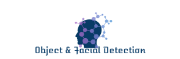
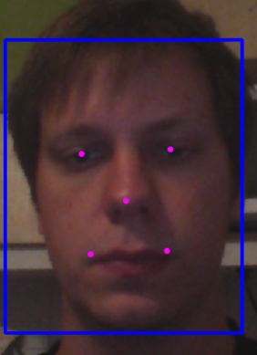
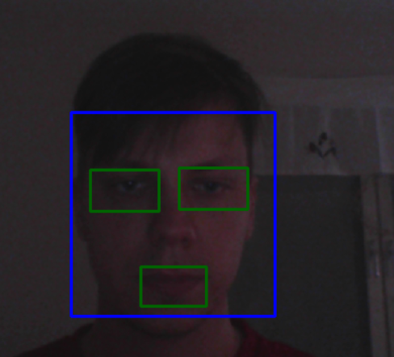
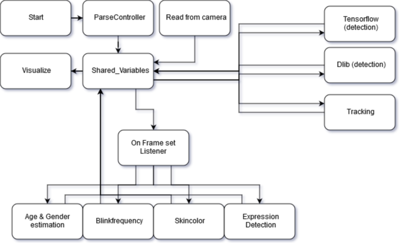
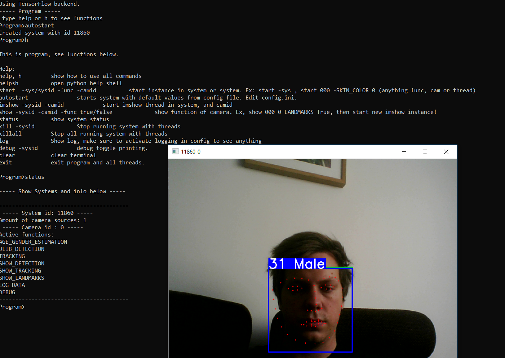
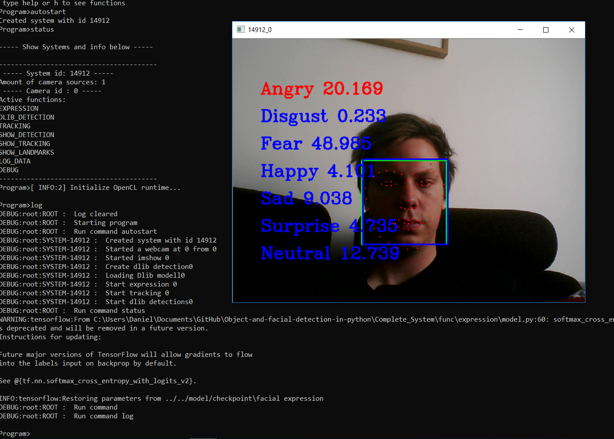

<p align="center">
  
</p>

Object detection (OB) is one of the computer technologies which are connected to the image processing and computer vision spectra of artificial intelligence. OB interacts with detecting instances of an object such as human faces, buildings, trees, cars, etc. The primary aim of face detection algorithms is to determine whether there are any human faces in an image or not. This repo primarly contains:
* training material for learning and using object and face detection.
* `dlib`, `opencv` and `tensorflow` implementation.
* Complete System - A system i created that makes it possible to test several cool functions with face detections.


<details>
  <summary><strong>Table of Contents</strong> (click to expand)</summary>

<!-- toc -->

- [Getting Started](#Getting Started)
- [Requirements](#Requirements)
- [Models](#Models)
- [Training Material](#Training Material)
- [Dlib](#Dlib)
- [Tensorflow](#Tensorflow)
- [OpenCV](#Opencv)
- [Complete System Implementation](#Complete System Implementation)
- [Known issues](#Known issues)
- [Contribute](#contribute)
- [License](#license)
- [References, Sources & Contributors](#References, Sources & Contributors)
<!-- tocstop -->

</details>

## Getting Started
Here we describe how to run different implementations.

### Requirements
This repo contains a autogenerated requirements file that can be used to install libraries. There is a possibility that this requirments file will be outdated as I add more implementations. `README`-files in each implementation folder describe which packages are needed to run them.
``bash
pip install -r requirements.txt
```
Start the implementations by running this in implementation folder:
``bash
python start.py
```
To use any detection you will need to download and add models. See [Models](#Models) below for more information and download link!

Download or clone this repo:
``bash
git clone https://github.com/grebtsew/Object-and-facial-detection-in-python.git
```

### Models
Models used in this repo are as mentioned above excluded. You will need to download them from linked repos or from link below, see code or readme in `Learning & documentation folder`. I'm working with the models outside of the git repo in a folder named "model". The folder architecture looks like this:

github/
- model/
- Object-and-facial-detection-in-python/

I share the model folder as .rar on google-drive. (This might get removed in the future!) Download it and replicate the hierarchy above.
* Link to models on drive:  https://drive.google.com/open?id=1-_h1t8SBnTqh52xsZtY186zdrPjfnAtA

### Links to models (origin)
Here are links to repos where models can be downloaded:
* tensorflow `MTCNN` (already in repo) : https://github.com/habrman/FaceRecognition
* `dlib` with `landmarks and blink detection` : https://github.com/iparaskev/simple-blink-detector
* `Expression detector` : https://github.com/JostineHo/mememoji
* `age/gender estimation` : https://github.com/yu4u/age-gender-estimation
* yolo implementations : https://github.com/qqwweee/keras-yolo3, https://github.com/heartkilla/yolo-v3

# Learning & Documentation
See folder `Learning & Documentation`.
In the folder `Learning & Documentation` I show my learning process of object detection, facial detection and how to work with `tensorflow` and `dlib`. Repositories used to develop code in this repository is linked in `Learning & Documentation`-folder `README`. This folder also contains a short tutorial of how to fastly create your own `tensorflow`-models.

# Implementations
In this part we shortly describe the content and usage of the folders `dlib`, `OpenCV`, `tensorflow` and `Complete_Sytem`.
Each of these folders contains a README-file that describe the implementations more detailed.

##  Dlib
See `dlib` folder.
Here I share a singel- and multithreaded [dlib](#https://github.com/davisking/dlib) solution for facial detection.
I am using code from several other repos with my code here.

This is how the `dlib` program look like during execution.


##  Tensorflow
See `tensorflow` folder.
Here I share a singel- and multithreaded [tensorflow](#https://www.tensorflow.org/) solution for facial detection and some functions like `skin_color`.
I am using code from several other repos with my code here.

This is how the tf program look like during execution.



##  OpenCV
See `opencv` folder.
Here I share a single- and multithreaded [OpenCV](#https://opencv.org/)
solution for facial detection and some functions liked SIFT detection.
This code assume from opencv documentation and is a machine learning approach to detection.

This is how the opencv program look like during execution.




## Complete System Implementation
This is my own implementation of a test system with a `parse-controller`. The system architecture is described by the image below. Here follows a short explaination of the architecture. `Start.py` starts the `parse-controller` that initiate the system. `Shared_Variables` is the centered shared node class that handle all data shared in the program. First of there is a read thread that reads images from a camera stream. These images are then sent to detection and tracking when renewed. The result is returned to `Shared_variables`. `Shared_variables` then invoke the `on_set_frame` listener and execute activated functions on seperate threads. Lastly the frame is sent to `Visualize` class that show the image. This is a multithreaded implementation and I recommend to run it on a high preformance computer. However it works just fine on my laptop!



As seen in the architecture several extra functions has been added, most relevant are (feel free to add more):

* `blink frequency` - intresting to know if someone is tierd
* `age/gender estimation` - just for fun
* `expressions` - intresting to know if someone is struggling
* `skincolor` - to see if there are any skin color changes in realtime.
* `logger` - log system events in data.log
* `config` - use settings in config.ini (i recommend editing this and use command autostart)
* `parse-controller` - a controller that lets you controll program from terminal
* `flipp-test` - a method to flipp camera if detection not found, this way detections work no matter which rotation the camera has
* `energy-save` - do less detections if missed alot of detections to save energy

If it is hard to understand how to use the `parse-controller` type help or h for some extra information. Let me know if something is hard to understand.
All models used must be downloaded from github repon linked in code!

Here are some example images:




### Known issues
At this time there are some known issues with the complete system:
* Only one of the major functions can run at a time due to current Keras implementation only can use one model at the same session.
* SKIN_COLOR doesn't use an instance, therefore will only work on the first running camera on system.
* Expression uses deprecated models, code that need to be changed, you will see some warnings.
* Too large files (mostly models) is ignored due to Github limitations, the models can be found in github-repos linked in learning folder readme.

# Contribute
If you want to add own content or want me to create more functions just let me know!

# License
Several implementations in this repo are forks from other creators, with those implementations the original License follows.
For content originaly created in this repository we use `MIT` [LICENSE](#LICENSE).

# References, Sources & Contributors
Each of the folders of this repository contains `README`-files that describe used references and source material.
Creator of this repo and contributor: Grebtsew.

COPYRIGHT (c) 2019 Grebtsew
